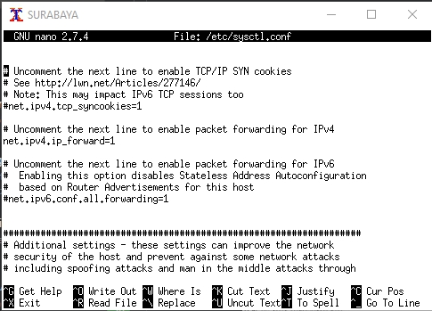
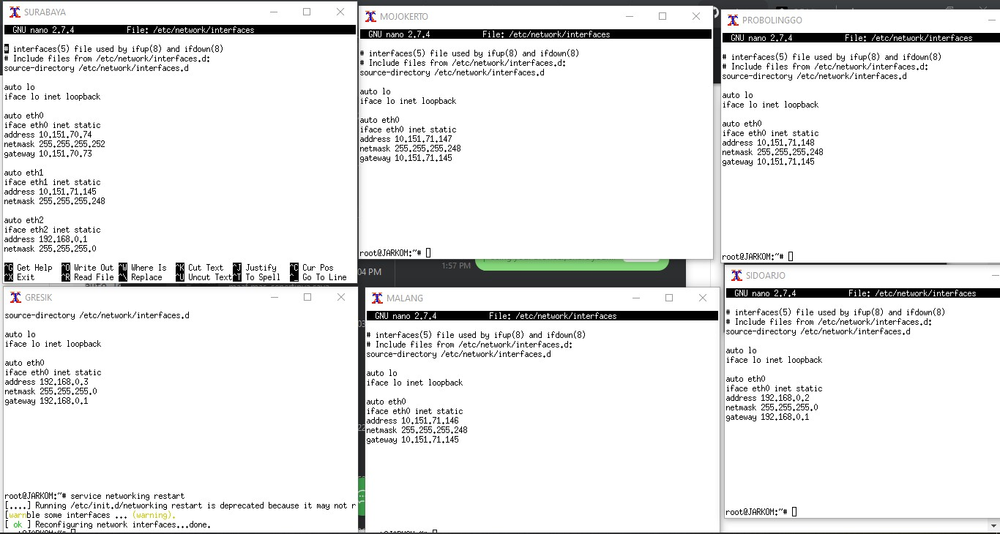

# Jarkom_Modul2_Lapres_T21

NAMA ANGGOTA :

ACHSAN NOORSALAM 05311840000021

I KOMANG ADITYA MAHADIHARJA 05311840000042

## MODUL 2 

## PENDAHULUAN

### membuat topologi

1. membuat topologi.sh pada putty

2. menghapus # pada net.ipv4.ip_forward=1 di nano /etc/sysctl.conf yang ada di UML SURABAYA

3. lalu melakukan command `sysctl -p` untuk menforward ip

2. mengatur IP pada setiap UML dengan menggunakan nano `/etc/network/interfaces`

3. lalu merestart koneksi dengan `service networking restart`
lakukan `iptables –t nat –A POSTROUTING –o eth0 –j MASQUERADE –s 192.168.0.0/16` pada router

. export proxy pada setiap UML
  lalu melakukan apt-get update pada setiap UML 

